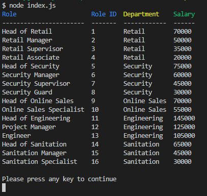

# Employee Tracker

## Description

This is an application designed to allow the user to manipulate and view information regarding a company's departments, roles, and employees. It's visually clean and easy to use.
Dependencies:
- [dotenv](https://github.com/motdotla/dotenv#readme)
- [Node MySQL2](https://github.com/sidorares/node-mysql2#readme)
- [Inquirer](https://github.com/SBoudrias/Inquirer.js/#prompt)
- [Chalk](https://github.com/chalk/chalk)
- [console.table](https://github.com/bahmutov/console.table)
- [press-any-key](https://github.com/morulus/press-any-key#readme)

This project's primary purpose is to demonstrate the ability to utilize databases like MySQL to manage and organize information in a neat and presentable fashion.
## Table of Contents

1.  [Installation](#installation)

2.  [Usage](#usage)

3.  [License](#license)

4.  [Contributing](#contributing)

5.  [Tests](#tests)

6.  [Questions](#questions)

7.  [Finished Product](#finished-product)

---

## [Installation](#installation)
>## Step One
>Clone or Download
>
>You can clone the repo directly from github here, or you can also download it as a zip file. Just look for the green button at the top right corner of the github repo.

>## Step Two
>Install dependencies
>
>Once you have the team_profile_generator on your computer, open up a terminal on the location of that folder. Afterwards, enter 'npm install'

>## Step Three
>Edit '.env' file
>
>You will need to edit the 'example.env' file to match your information and rename the file to '.env'
>The file contains:
>- host
>- user
>- password
>
>All of these will need to be updated correctly to your own database in order for it to work.

## [Usage](#usage)
>## Step One
>Navigate your terminal
>
>To actually run the app, you first need to make sure you have a terminal open at the location of the employee_tracker directory.

>## Step Two
>Start the app
>
>When you are at the right directory, enter 'npm start', which should run the application.

>## Step Three
>Utilize interface
>
>From here, it's easy and straight forward. Just look at the options you are given and select/confirm them as the prompts direct you to do. You can exit the app at any time by pressing 'ctrl+c' if you are on Windows, or 'Command + Option + Esc' if you are on Mac

---

## [License](#license)

 Copyright (c) 2022 Vidalatan Licensed under the MIT License license.

---

## [Contributing](#contributing)

Thank you for considering contributing to this project!

Following these contributing guidelines helps communicate that you respect the time of those who are managing and developing this open source project.
In return, you should recieve that same respect back in addressing your issue, assessing changes, and helping you finalize your pull requests.

There are many ways to contribute from documentation, tutorials, social media, but reports, feature requests or submitting your own code. Please feel 
encouraged to assist in any way applicable to your skills!

---

## [Tests](#tests)

Below is a quick demonstration of the basic usage of the application:

https://user-images.githubusercontent.com/59946423/161856653-2afaa1e2-4c65-4cda-bf87-a181d623bed7.mp4

There were also tests done to make sure that deleting departments or roles were restricted depending on if there was anything assigned to them:

https://user-images.githubusercontent.com/59946423/161856454-e4b7aff6-1102-4cd0-a2d2-5fc526294f8f.mp4

## [Questions](#questions)

 Questions regarding this project should be directed towards @Vidalatan at vidalatan@gmail.com

## [Finished Product](#finished_product)

Link to [Code Repository](https://github.com/vidalatan/employee_tracker)

